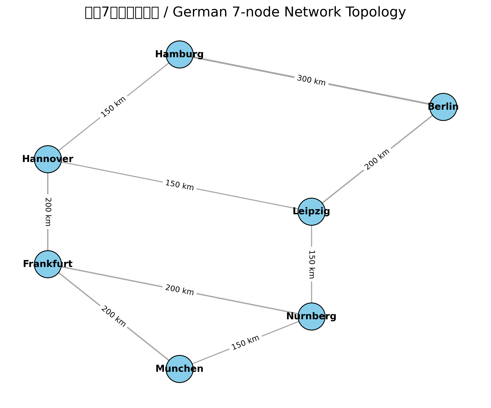
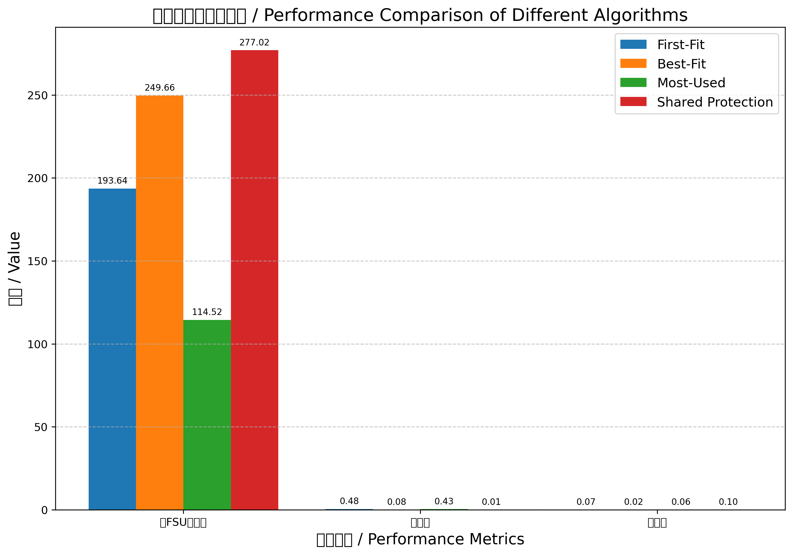
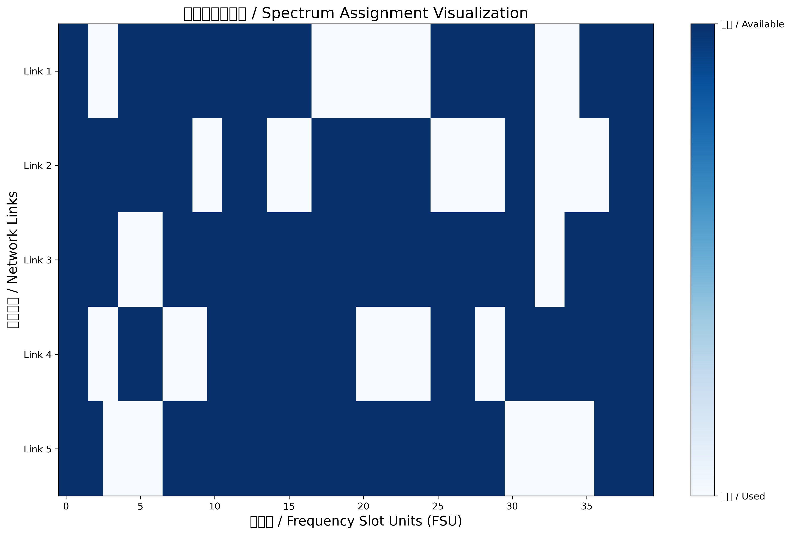

# 光网络路由与频谱分配（RMSA）仿真 / Optical Network Routing and Spectrum Assignment Simulation

这个项目是EEN115课程的最终项目，实现了光网络中的路由与频谱分配（Routing and Spectrum Assignment, RMSA）算法仿真。

*This project is the final project for the EEN115 course, implementing a simulation of Routing and Spectrum Assignment (RMSA) algorithms in optical networks.*

## 项目概述 / Project Overview

本项目实现了一个弹性光网络（Elastic Optical Network, EON）仿真系统，可以测试不同的路由策略和频谱分配算法组合，评估其性能。

*This project implements an Elastic Optical Network (EON) simulation system that can test different combinations of routing strategies and spectrum assignment algorithms to evaluate their performance.*

## 系统截图 / System Screenshots

### 网络拓扑 / Network Topology


### 仿真结果 / Simulation Results


### 频谱分配可视化 / Spectrum Assignment Visualization


## 功能特点 / Features

- 支持不同的路由算法 / Supports different routing algorithms:
  - 固定最短路径（Dijkstra算法） / Fixed shortest path (Dijkstra's algorithm)
  - K最短路径（Yen算法） / K shortest paths (Yen's algorithm)
  - 基于负载的路径选择 / Load-based path selection
  - 基于熵最小化的路径选择 / Entropy minimization-based path selection
  
- 支持多种频谱分配策略 / Supports various spectrum assignment strategies:
  - First-Fit（首次适配） / First-Fit
  - Most-Used（最常使用） / Most-Used
  - Best-Fit（最佳适配） / Best-Fit
  - 共享保护分配 / Shared protection assignment

- 支持调制格式感知的路由选择 / Modulation-aware routing selection
- 流量拆分处理超大容量请求 / Traffic splitting for extremely large capacity requests
- 失效保护和备份路径设计 / Failure protection and backup path design
- 网络碎片化度量和分析 / Network fragmentation measurement and analysis

## 项目结构 / Project Structure

- `spectrum_assignment.py`: 实现了各种频谱分配算法 / Implements various spectrum assignment algorithms
- `routing.py`: 实现了各种路由算法和路径选择策略 / Implements various routing algorithms and path selection strategies
- `modulation.py`: 实现了调制格式选择和FSU计算 / Implements modulation format selection and FSU calculation
- `network.py`: 网络拓扑和流量加载功能 / Network topology and traffic loading functions
- `metrics.py`: 计算性能指标和碎片化测量 / Calculates performance metrics and fragmentation measurements
- `fs_main.py`: 固定最短路径仿真主程序 / Fixed shortest path simulation main program
- `ks_main.py`: K最短路径仿真主程序 / K shortest paths simulation main program
- `Task4_1+1.py`: 1+1保护机制仿真 / 1+1 protection mechanism simulation
- `Task5_shared.py`: 共享保护仿真 / Shared protection simulation
- `visualization.py`: 可视化工具 / Visualization tools
- `EEN115_Final_Report-Group6.pdf`: 详细的项目报告 / Detailed project report
- `Germany-7nodes/`, `Italian-10nodes/`: 测试拓扑和流量矩阵 / Test topologies and traffic matrices

## 使用方法 / Usage

1. 配置Python环境（需要numpy和networkx库）/ Configure Python environment (requires numpy and networkx libraries)
2. 选择并运行仿真主程序，例如 / Select and run the simulation main program, e.g.:

```python
python fs_main.py  # 固定路径仿真 / Fixed path simulation
python ks_main.py  # K最短路径仿真 / K shortest paths simulation
python Task4_1+1.py  # 1+1保护仿真 / 1+1 protection simulation
python Task5_shared.py  # 共享保护仿真 / Shared protection simulation
```

3. 更改主程序中的拓扑文件和流量矩阵路径可以测试不同的网络场景 / Change the topology file and traffic matrix paths in the main program to test different network scenarios

## 性能指标 / Performance Metrics

仿真结果包括 / Simulation results include:
- 使用的总FSU数量 / Total number of FSUs used
- 网络碎片化熵 / Network fragmentation entropy
- 频谱利用率 / Spectrum utilization
- 每条链路的最高FSU索引 / Highest FSU index for each link

## 许可 / License

本项目采用MIT许可证。

*This project is licensed under the MIT License.* 