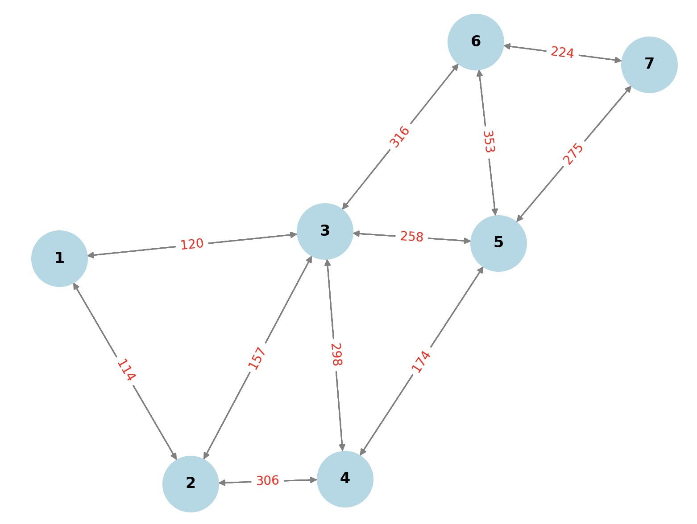
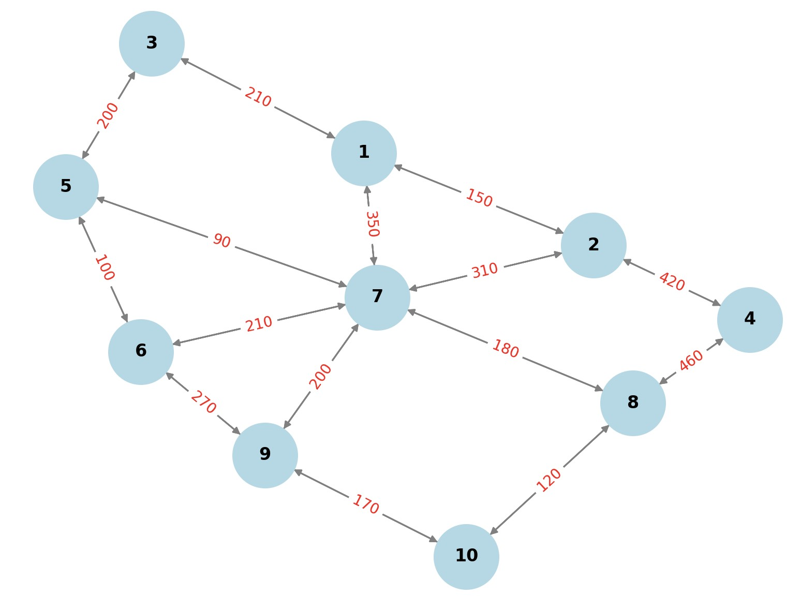

# Optical Network Routing and Spectrum Assignment Simulation

This project is the final project for the EEN115 course, implementing a simulation of Routing and Spectrum Assignment (RMSA) algorithms in optical networks.

## Project Overview

This project implements an Elastic Optical Network (EON) simulation system that can test different combinations of routing strategies and spectrum assignment algorithms to evaluate their performance.

## System Screenshots

### Network Topologies



### Performance Analysis
.jpg)

### Spectrum Assignment Visualization


## Features

- Supports different routing algorithms:
  - Fixed shortest path (Dijkstra's algorithm)
  - K shortest paths (Yen's algorithm)
  - Load-based path selection
  - Entropy minimization-based path selection
  
- Supports various spectrum assignment strategies:
  - First-Fit
  - Most-Used
  - Best-Fit
  - Shared protection assignment

- Modulation-aware routing selection
- Traffic splitting for extremely large capacity requests
- Failure protection and backup path design
- Network fragmentation measurement and analysis

## Project Structure

- `spectrum_assignment.py`: Implements various spectrum assignment algorithms
- `routing.py`: Implements various routing algorithms and path selection strategies
- `modulation.py`: Implements modulation format selection and FSU calculation
- `network.py`: Network topology and traffic loading functions
- `metrics.py`: Calculates performance metrics and fragmentation measurements
- `fs_main.py`: Fixed shortest path simulation main program
- `ks_main.py`: K shortest paths simulation main program
- `Task4_1+1.py`: 1+1 protection mechanism simulation
- `Task5_shared.py`: Shared protection simulation
- `visualization.py`: Visualization tools
- `EEN115_Final_Report-Group6.pdf`: Detailed project report
- `Germany-7nodes/`, `Italian-10nodes/`: Test topologies and traffic matrices

## Usage

1. Configure Python environment (requires numpy and networkx libraries)
2. Select and run the simulation main program, e.g.:

```python
python fs_main.py  # Fixed path simulation
python ks_main.py  # K shortest paths simulation
python Task4_1+1.py  # 1+1 protection simulation
python Task5_shared.py  # Shared protection simulation
```

3. Change the topology file and traffic matrix paths in the main program to test different network scenarios

## Performance Metrics

Simulation results include:
- Total number of FSUs used
- Network fragmentation entropy
- Spectrum utilization
- Highest FSU index for each link

## License

This project is licensed under the MIT License.

---

# 光网络路由与频谱分配（RMSA）仿真

这个项目是EEN115课程的最终项目，实现了光网络中的路由与频谱分配（Routing and Spectrum Assignment, RMSA）算法仿真。

## 项目概述

本项目实现了一个弹性光网络（Elastic Optical Network, EON）仿真系统，可以测试不同的路由策略和频谱分配算法组合，评估其性能。

## 系统截图

### 网络拓扑


### 性能分析
.jpg)

### 频谱分配可视化


## 功能特点

- 支持不同的路由算法：
  - 固定最短路径（Dijkstra算法）
  - K最短路径（Yen算法）
  - 基于负载的路径选择
  - 基于熵最小化的路径选择
  
- 支持多种频谱分配策略：
  - First-Fit（首次适配）
  - Most-Used（最常使用）
  - Best-Fit（最佳适配）
  - 共享保护分配

- 支持调制格式感知的路由选择
- 流量拆分处理超大容量请求
- 失效保护和备份路径设计
- 网络碎片化度量和分析

## 项目结构

- `spectrum_assignment.py`: 实现了各种频谱分配算法
- `routing.py`: 实现了各种路由算法和路径选择策略
- `modulation.py`: 实现了调制格式选择和FSU计算
- `network.py`: 网络拓扑和流量加载功能
- `metrics.py`: 计算性能指标和碎片化测量
- `fs_main.py`: 固定最短路径仿真主程序
- `ks_main.py`: K最短路径仿真主程序
- `Task4_1+1.py`: 1+1保护机制仿真
- `Task5_shared.py`: 共享保护仿真
- `visualization.py`: 可视化工具
- `EEN115_Final_Report-Group6.pdf`: 详细的项目报告
- `Germany-7nodes/`, `Italian-10nodes/`: 测试拓扑和流量矩阵

## 使用方法

1. 配置Python环境（需要numpy和networkx库）
2. 选择并运行仿真主程序，例如：

```python
python fs_main.py  # 固定路径仿真
python ks_main.py  # K最短路径仿真
python Task4_1+1.py  # 1+1保护仿真
python Task5_shared.py  # 共享保护仿真
```

3. 更改主程序中的拓扑文件和流量矩阵路径可以测试不同的网络场景

## 性能指标

仿真结果包括：
- 使用的总FSU数量
- 网络碎片化熵
- 频谱利用率
- 每条链路的最高FSU索引

## 许可

本项目采用MIT许可证。 